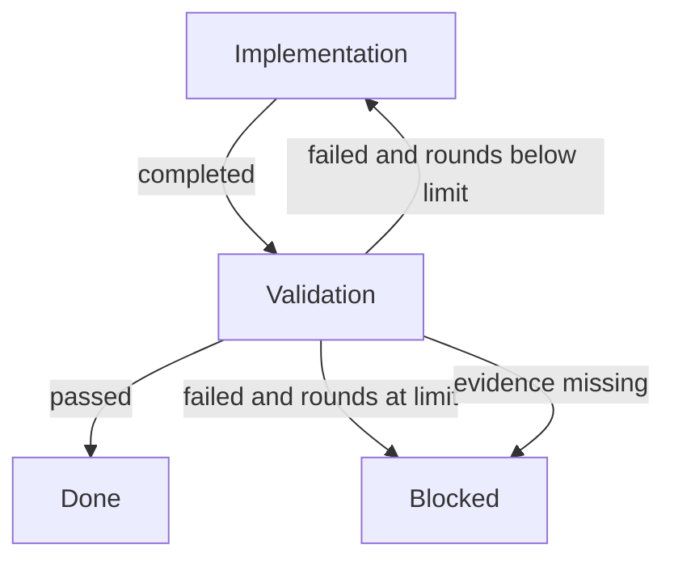
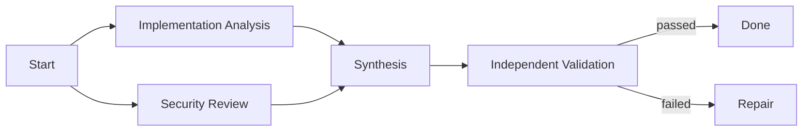

# Graph Engineering、AgentSpace 与 PersonaHub 定位及架构优化分析

> Status: research archive  
> 本文是调研与方案建议，不是产品需求真相源。正式定位、范围和路线仍以 `docs/personahub-prd.md` 为准；本文建议只有经过确认并回写 PRD / Architecture / Feature Spec 后才构成实施承诺。

## 1. 执行摘要

### 1.1 核心结论

PersonaHub 不需要改名或转型为“Graph Engineering 平台”，但应该把 **Executable Work Graph（可执行工作图）** 提升为 v0.2 之后多 Agent 协作编排的核心架构。

推荐保持一级定位：

> PersonaHub 是个人优先、开源可自托管的 AI Agent Team OS。

建议补充二级产品表达：

> 以 Issue 管理目标，以可执行 Work Graph 组织 Agent 协作，以 Evidence 验证结果，并从真实运行中持续改进的个人 Agent Team OS。

英文可表达为：

> A local-first Agent Team OS for turning issues into executable, verifiable, and continuously improving work graphs.

调整的是“协作如何被建模和运行”，不是 PersonaHub 服务的用户问题和产品品类。

### 1.2 AgentSpace 的准确判断

AgentSpace 具有明显的 graph-shaped 产品形态，但当前并不是完整的通用 Graph Runtime：

1. 它用 Workspace、Human、Digital Employee、Channel、Runtime 和 Permission 构成组织型控制面。
2. 它用 AgentRouter 分离 Agent 身份、Provider Session、Runtime 和 Task Attempt。
3. 它在“频道文档协作”场景中实现了真正承重的小型 DAG：
   - 自然语言 `@A ... 然后 @B ...` 被编译成步骤。
   - 每个步骤有 `dependsOnStepIds`。
   - 上游完成后解锁下游。
   - 文档 ID 和文档版本作为 handoff 传递。
4. 但该 DAG 与 Channel / Document / Mention 深度绑定，没有独立 Edge、条件路由、循环、通用 Join、版本化 Graph Definition、完整失败恢复和统一并行 GraphRun。

因此，AgentSpace 更准确的定位是：

> 成熟度较高的 Agent Workplace / Runtime Control Plane，加上一条领域专用依赖工作流。

### 1.3 两项目最有价值的互补关系

AgentSpace 当前做得更好的部分：

- 自然语言生成依赖计划。
- Agent identity 与 runtime 分离。
- pending → ready → queued → running 的依赖调度。
- 具体文档版本的 Artifact Handoff。
- Workspace、权限、预算、审批和 daemon 控制面。

PersonaHub 当前做得更好的部分：

- Project / Issue / Thread 的目标与生命周期建模。
- Workflow Template / Validation Policy 产品模型。
- 独立 Validator。
- Deterministic Evidence Gate。
- Validation round、失败上限、Blocked 和显式 reset。
- Provider identity snapshot、file trace、verification evidence。
- Workspace lock、credential isolation 和状态机不变量。

PersonaHub 最合理的方向不是复制 AgentSpace 的宽 Workplace，而是：

> 借鉴 AgentSpace 的自然交互和依赖调度，用 PersonaHub 更强的 Issue、Validation、Evidence 和安全机制构建通用 Executable Work Graph。

## 2. 调研范围与方法

### 2.1 本地代码基线

本次分析以本地 checkout 为准：

| 项目 | 路径 | 分支/提交 | 状态 |
|---|---|---|---|
| PersonaHub | `D:\Projects\personahub` | `main @ b7cface` | 比 `origin/main` ahead 2 |
| AgentSpace | `D:\Projects\AgentSpace` | `main @ 0f9da1b` | 与 `origin/main` 一致 |

AgentSpace 本地仓库没有额外 `AGENTS.md` / `CLAUDE.md`；`Target.md` 将其定义为：

> A multi-user, multi-agent workspace where human teams and digital employees share context, permissions, runtimes, approvals, and delivery outputs.

### 2.2 重点检查对象

AgentSpace：

- `packages/domain/src/mention-plan.ts`
- `packages/domain/src/channel-document-runs.ts`
- `packages/services/src/messages/messages.ts`
- `packages/services/src/documents/runs.ts`
- `packages/services/src/documents/sync.ts`
- `packages/daemon/src/agent-router/types.ts`
- `packages/db/src/task-queue.ts`
- `packages/db/src/agent-router-sessions.ts`
- `packages/domain/src/workspace.ts`
- `apps/web/features/org-chart/org-chart-page-client.tsx`
- `TODO/README.md`

PersonaHub：

- `docs/personahub-prd.md`
- `docs/personahub-system-design.md`
- `docs/personahub-architecture.md`
- F003 Development Trace
- F004 Autonomous Validation
- F005 Manual Multi-Agent Routing
- `server/src/services/validation/*`
- `server/src/services/manual-routing-service.ts`
- `server/src/services/run-context-builder.ts`
- `server/src/services/workspace-lock.ts`

### 2.3 判断标准

本文不以“代码里是否出现 graph 这个词”作为判断标准，而采用下面的承重标准：

1. 拓扑是否真实约束执行。
2. 节点是否有可检查的责任和生命周期。
3. 边是否表达真实依赖、路由和数据传递。
4. 声明图与实际运行图是否可追溯。
5. 中断、失败、重试和人工介入后是否能安全恢复。
6. Artifact / Evidence 是否保留因果谱系。
7. 图是否可版本化、测试、评价和改进。

## 3. Graph Engineering 的适用定义

### 3.1 不是一种全新基础技术

Graph Engineering 是状态机、工作流编排、多 Agent 系统、可靠执行、可观测性和评价闭环在 Agent 时代的统一表达。

它的核心不是画图，而是让图承重：

```text
Nodes
  执行有边界的工作。

Edges
  定义允许的迁移、依赖和数据传递。

State
  保存任务当前事实，而不是依赖某个模型上下文。

Artifacts / Evidence
  连接输入、执行、结果和验证。

Policies
  约束权限、预算、重试、终止和人工升级。
```

### 3.2 与 PersonaHub 相关的三类图

#### Work Graph

描述任务如何执行：

- Agent task。
- Deterministic action。
- Validator。
- Router。
- Human gate。
- Fan-out / Join。
- Retry / Recovery。

#### Evidence / Lineage Graph

描述结果为何可信：

- 哪个 Node 使用了哪些输入。
- 哪个 Attempt 产生了哪些 Artifact。
- 哪个 Validator 检查了哪些结果。
- 哪条 Evidence 支撑最终结论。
- 哪个 Policy Snapshot 决定了通过条件。

#### Improvement Graph

描述系统如何进化：

- Workflow version。
- Agent / model / provider。
- Cost / duration / success。
- Human override。
- Validation false positive / false negative。
- Memory / Skill / Workflow Patch Candidate。

### 3.3 不应混淆的概念

Knowledge Graph / GraphRAG 主要解决实体、事实和关系的知识组织问题，不是 PersonaHub 近期协作编排的中心。

PersonaHub 可以在未来让 Memory / Evidence 使用图关系，但不需要因为 Graph Engineering 热度而提前引入图数据库或把产品定位改成 Knowledge Graph 平台。

## 4. AgentSpace 源码拆解

### 4.1 组织图主要是产品心智，不承载执行

AgentSpace 的 `ActiveEmployee` 包含：

- `name`
- `role`
- `ownerUserId`
- `traits`
- `skillIds`
- `channels`
- `instructions`

它没有 manager、reports-to、supervisor 等执行关系。

Org Chart UI 提供：

- Human Members 分组。
- Agents 分组。
- By Group / Channel 展示。

这属于组织资源可见化，不是执行拓扑。不能把 Org Chart 直接等同于 Collaboration Topology。

### 4.2 AgentRouter 是成熟的执行适配层

AgentSpace 明确区分：

```text
Digital Employee Identity
  └─ Router Session
      ├─ Provider Session
      ├─ Task Attempt on Runtime A
      └─ Task Attempt on Runtime B
```

`AgentTaskAttemptRecord` 已包含：

- `taskQueueId`
- `routerSessionId`
- `runtimeId`
- `provider`
- `providerSessionId`
- `status`
- `handoffSnapshotId`
- `metadataJson`

这使同一个数字员工能够在不同 runtime 上保持逻辑身份，并在 provider session 失效后通过显式 context / memory / handoff snapshot 重建。

该设计说明：

> 逻辑工作、Agent 身份、Provider 会话和具体执行尝试必须分层。

### 4.3 MentionPlan 是自然语言 Graph Compiler 的雏形

`parseMentionPlan()` 从消息中识别：

- Agent mentions。
- “然后、再、之后、接着、完成后、先”等顺序标记。
- “发给、交给、转给”等直接 handoff。
- document / attachment / message handoff kind。

输出：

```ts
interface MentionStep {
  id: string;
  agentId: string;
  agentLabel: string;
  instruction: string;
  dependsOnStepIds: string[];
  handoffKind: "document" | "attachment" | "message";
}

interface MentionPlan {
  mode: "parallel" | "sequential";
  steps: MentionStep[];
  warnings: string[];
  unknownMentions: string[];
}
```

优点：

- 用户不需要先学习画布。
- 系统把自然语言“然后”转成显式依赖。
- 表达模糊时会要求用户重写，而不是静默猜测。
- Plan 可在执行前检查。

局限：

- 基于关键词和 mentions，不是通用规划器。
- Node 直接绑定 Agent。
- 只能稳定表达简单顺序或无依赖并行。
- 没有条件边、循环、Join policy 和 Schema contract。

### 4.4 ChannelDocumentRun 是领域专用 DAG Runtime

AgentSpace 将顺序 plan 实例化为：

```text
ChannelDocumentRun
  ├─ sourceMessageId
  ├─ mode
  └─ status

ChannelDocumentRunStep
  ├─ agentId
  ├─ instruction
  ├─ dependsOnStepIds
  ├─ handoffKind
  ├─ queuedTaskId
  ├─ documentId
  ├─ documentVersionId
  └─ status
```

步骤状态：

```text
pending
  ↓ dependencies satisfied
ready
  ↓ enqueued
queued
  ↓ claimed
running
  ↓
completed | completed_with_warning | failed | blocked
```

上游完成后，runtime 遍历候选下游：

```text
all dependencies completed or completed_with_warning
  -> candidate becomes ready
```

这是实际约束执行的依赖图，不是装饰性 Graph。

### 4.5 Artifact Handoff 是最值得借鉴的部分

当上游步骤产生文档时，AgentSpace 保存：

- `documentId`
- `documentVersionId`

下游变为 ready 后，系统从所有前驱收集对应文档及版本并传入下游任务。

这比“把上一轮聊天总结塞给下一个 Agent”更可靠，因为：

- 输出有稳定身份。
- 版本明确。
- 下游知道消费的具体对象。
- 冲突和 stale version 可以被检测。
- Artifact 可以脱离 Provider session 持久存在。

### 4.6 AgentSpace 当前图模型的边界

#### Node 与 Agent 绑定

节点表达“让 Atlas 做这一步”，而不是“完成一项需要某类能力的工作”。

后果：

- Workflow 难以复用。
- Agent 不可用时难以自动替换。
- 评价容易混淆节点难度与 Agent 能力。
- 同一个业务节点重试时会被误认为不同工作。

#### Edge 不是一等对象

`dependsOnStepIds` 只能表达前置依赖，不能表达：

- success / failure outcome。
- 条件路由。
- Edge payload schema。
- 路由 authority。
- 权限变化。
- all / any / quorum。
- retry / compensation。
- 回边和终止条件。

#### Graph Definition 与 Graph Run 未分离

图来自单条消息，没有独立、版本化、可发布的 Workflow Graph Definition。

#### 并行绕过统一 Run

当前只有被识别为多步骤 sequential 的路径创建 `ChannelDocumentRun`。普通并行 mentions 直接分别进入任务队列，没有统一 GraphRun、Join、整体预算和聚合完成条件。

#### 失败传播与恢复较弱

步骤失败主要将 step/run 标记为 failed，尚未完整表达：

- 下游 skipped 还是 blocked。
- 自动 retry。
- fallback executor。
- Human recovery。
- 从失败节点恢复。
- 最大循环轮次。

#### Durable Graph State 仍偏弱

`channelDocumentRuns` 和 `channelDocumentRunSteps` 仍是 Workspace State 中的数组，而不是专门用于原子 claim、依赖查询和恢复的规范化运行表。

#### 并发执行基础设施仍在演进

AgentSpace 当前一台 daemon 对每个 provider 主要注册一个 runtime；provider concurrency、同 Agent 互斥、workDir 隔离和 session 连续性之间仍有待收敛。

### 4.7 AgentSpace 自己对短板的判断

`TODO/README.md` 把下面内容列为长期补齐项：

> durable control plane、sandbox 远程执行、多 agent 编排与协作层补齐。

因此，不应把 AgentSpace 当前实现视为成熟 Graph Runtime 的架构答案；它更适合作为自然交互、Agent/Runtime 分层和 Artifact Handoff 的优秀参考。

## 5. PersonaHub 当前状态与 Graph Engineering 缺口

### 5.1 已有的正确基础

PersonaHub PRD 已经提出：

- Issue Type。
- Workflow Template。
- Collaboration Topology。
- Agent Team Template。
- Handoff Packet。
- Validation Policy。
- Room。
- Artifact。
- Evidence。
- Memory / Skill。

F003–F005 已落地：

- Run event trace。
- File change trace。
- Evidence refs。
- Implementation → Validator。
- Evidence policy gate。
- Validation round / max rounds。
- Blocked / Unblock / Reset。
- Manual multi-provider routing。
- `context_source_run_id`。
- Provider identity snapshot。
- Workspace-aware adapter availability。

这些能力已经覆盖 Graph Engineering 最难的部分之一：图执行结果的可验证性和安全边界。

### 5.2 当前主要问题

#### Topology 尚未真正承重

`WorkflowTemplate` 有：

- `collaboration_topology`
- `steps_json`

但当前 runtime 仍主要由特定 service 编码顺序和状态转换。Topology 更接近描述字段，而不是通用可执行程序。

#### Workflow Step、Run 和 Attempt 没有分层

当前 `Run` 同时承担：

- 一项逻辑工作。
- 某次 Agent 执行。
- 某次 Provider/Model 尝试。
- 状态机驱动对象。

复杂图下，同一逻辑节点可能经历多次 attempt，因此必须分层。

#### 只有单前驱 Context Source

`context_source_run_id` 能清晰绑定一次 handoff，但只能表示一个上游。

Fan-in 场景需要：

```text
Synthesis Node
  inputs:
    - Research A artifact
    - Research B artifact
    - Security review evidence
```

因此需要多对多 causal inputs。

#### Workspace Lock 限制并行

当前 workspace 写锁为正确性提供了重要底线，但也意味着同一 workspace 内多个写节点不能并行。

第一阶段应只开放：

- read-only research。
- read-only review。
- 独立外部数据查询。
- 不共享可变文件的并行任务。

并行 coding 需要 worktree / branch / execution workspace 隔离后再开放。

#### Evidence Summary 假设单实现、单验证

当前 Evidence Summary 主要关联：

- 一个 implementation Run。
- 一个 validator Run。

多节点 Graph 需要汇总：

- GraphRun。
- 多个 NodeRun。
- 多个 Attempt。
- Artifact lineage。
- 多 Validator / Join。

#### Agent capability 粒度不足

当前实现以 implementation / validator 为主。Graph 节点需要更丰富但仍受控的能力表达，例如：

- code_implementation
- code_review
- security_review
- research
- synthesis
- citation_check
- host_diagnostics
- document_edit

能力不能无限自由文本化，应有注册表、版本和兼容策略。

## 6. 定位优化建议

### 6.1 建议：保持 Agent Team OS 一级定位

**理由：**

1. Graph Engineering 是机制，不是用户最终购买或采用的结果。
2. “Agent Team OS”能覆盖 Issue、Workspace、Runtime、Evidence、Memory 和 Skill。
3. 直接定位 Graph Platform 会与 LangGraph、ADK、AutoGen 等开发框架进入同一心智区间。
4. PersonaHub 的差异在个人真实工作闭环，而不是提供另一个 SDK。

### 6.2 建议：把 topology-aware 升级为 executable work graph

当前：

> issue-managed, topology-aware, evidence-grounded automation

建议：

> issue-managed, graph-orchestrated, evidence-grounded work

或更完整地表达：

> Turn personal issues into executable, verifiable, and continuously improving agent work graphs.

**理由：**

- topology-aware 容易停留在“知道拓扑类型”。
- executable 明确拓扑必须约束运行。
- work graph 可以统一 Workflow、Room、Handoff、Artifact 和 Evidence。
- graph 是二级能力表达，不抢走 Agent Team OS 一级品类。

### 6.3 建议：坚持 Issue-first，不改成 Canvas-first

**理由：**

1. 用户目标通常以 Issue 表达，而不是以图开始。
2. 画布增加建模负担。
3. 自然语言 → Graph Draft 更符合 Agent 产品。
4. Thread 是人类理解过程和介入的最佳入口。
5. Graph Inspector 可以作为解释和调试视图，而不是默认创作入口。

推荐 UI：

```text
Issue List | Thread / Work Scene | Graph + Evidence Inspector
```

## 7. PersonaHub Executable Work Graph v1

### 7.1 核心设计原则

#### Node 表达责任，不表达固定 Agent

错误：

```text
Node = Claude
```

推荐：

```text
Node = Security Review
required_capabilities = [security_review, code_read]
selected_executor = Claude
fallback_executor = Codex
```

**理由：**

- Workflow 可复用。
- Agent 可替换。
- 节点评价和 Agent 评价可以分开。
- Provider 失败不改变业务拓扑。

#### Edge 是一等契约

Edge 至少表达：

- source / target。
- outcome。
- condition。
- payload mapping。
- routing authority。
- join policy。
- permission transition。

**理由：**

只用 `dependsOn` 无法承载 validation loop、human gate 和 failure recovery。

#### Definition、Run、NodeRun、Attempt 分层

```text
WorkflowGraphDefinition
  └─ GraphVersion
      └─ GraphRun
          ├─ NodeRun
          │   ├─ Attempt 1
          │   └─ Attempt 2
          └─ EdgeTraversal
```

**理由：**

- Definition 负责复用和版本化。
- GraphRun 记录某次 Issue 的实际拓扑。
- NodeRun 表达逻辑工作。
- Attempt 表达具体 Agent / Provider 执行。

### 7.2 建议的定义模型

```ts
interface WorkflowGraphDefinition {
  id: string;
  name: string;
  issueType: string;
  version: number;
  nodes: WorkflowNodeDefinition[];
  edges: WorkflowEdgeDefinition[];
  entryNodeIds: string[];
  terminalNodeIds: string[];
}

interface WorkflowNodeDefinition {
  id: string;
  kind:
    | "agent_task"
    | "deterministic_action"
    | "validator"
    | "router"
    | "human_gate"
    | "join"
    | "subgraph"
    | "terminal";

  title: string;
  objective: string;
  requiredCapabilities: string[];

  inputContract?: SchemaRef;
  outputContract?: SchemaRef;
  artifactRequirements?: ArtifactRequirement[];
  evidenceRequirements?: EvidenceRequirement[];

  executionPolicy: {
    maxAttempts: number;
    timeoutSeconds?: number;
    idempotencyScope?: string;
  };

  resourcePolicy: {
    workspaceAccess: "none" | "read" | "write";
    networkAccess?: string[];
    credentialScopes?: string[];
  };

  budgetPolicy?: {
    maxTokens?: number;
    maxCostUsd?: number;
    maxDurationSeconds?: number;
  };
}

interface WorkflowEdgeDefinition {
  id: string;
  from: string;
  to: string;
  outcome: string;
  condition?: string;
  routingAuthority: "system" | "coordinator" | "human";
  joinPolicy?: "all" | "any" | "quorum";
  payloadMapping?: {
    artifactSelectors?: string[];
    evidenceSelectors?: string[];
    stateFields?: string[];
  };
}
```

### 7.3 建议的运行模型

```ts
interface GraphRun {
  id: string;
  issueId: string;
  graphDefinitionId: string;
  graphVersion: number;
  status: "pending" | "running" | "completed" | "failed" | "blocked" | "cancelled";
  definitionSnapshotJson: string;
  startedAt?: string;
  completedAt?: string;
}

interface NodeRun {
  id: string;
  graphRunId: string;
  nodeDefinitionId: string;
  status:
    | "pending"
    | "ready"
    | "queued"
    | "running"
    | "succeeded"
    | "failed"
    | "blocked"
    | "skipped"
    | "cancelled";
  selectedAgentId?: string;
  attemptCount: number;
  outcome?: string;
}

interface NodeAttempt {
  id: string;
  nodeRunId: string;
  runId: string; // 可先复用现有 Run
  agentConfigId: string;
  providerIdentitySnapshot: string;
  status: string;
}

interface EdgeTraversal {
  id: string;
  graphRunId: string;
  edgeDefinitionId: string;
  sourceNodeRunId: string;
  targetNodeRunId?: string;
  outcome: string;
  decisionActorType: "system" | "agent" | "human";
  decisionActorId?: string;
  reason?: string;
  payloadRefsJson: string;
}
```

### 7.4 存储建议

#### Definition 可以使用不可变 JSON Snapshot

原因：

- Graph Definition 是版本化声明。
- 读取时通常需要完整编译。
- 不需要频繁按单条边事务更新。
- Snapshot 有利于历史回放。

#### Runtime 必须规范化

建议独立表：

- `graph_runs`
- `node_runs`
- `node_attempts`
- `edge_traversals`
- `node_input_refs`
- `node_output_refs`

原因：

- 原子 claim ready node。
- 并发安全。
- 快速查询 blocked / running / retryable。
- 避免大型 state JSON 写冲突。
- 支持恢复和 AgentOps 聚合。

### 7.5 Graph Compiler / Linter

Graph Definition 在发布或执行前必须检查：

- Node ID / Edge ID 唯一。
- Entry / terminal 存在。
- 无不可达节点。
- 所有 edge target 存在。
- 非 terminal 节点至少有一条可结束路径。
- 循环有明确 max rounds / termination condition。
- Join 引用合法前驱。
- Capability 可解析。
- Input / output contract 可连接。
- Write 节点并行冲突。
- Budget 上限存在。
- Human gate 与危险权限对应。
- Validator 的 evidence requirements 完整。

**理由：**

Graph 的价值之一是把隐式失败路径提前暴露；没有 compiler 的 Graph 只是更复杂的配置文件。

## 8. 从现有 Coding Workflow 迁移

### 8.1 当前隐式图



### 8.2 迁移后的原则

F004 现有逻辑继续负责：

- 解析 validator envelope。
- deterministic policy gate。
- validation round。
- max rounds。
- Evidence Summary。
- Blocked reason。

Graph Runtime 负责：

- Node 状态。
- 根据 outcome 选择合法 Edge。
- 创建下一 NodeRun / Attempt。
- 记录 EdgeTraversal。
- 判断 GraphRun terminal status。

**理由：**

不能把严格业务不变量降级为通用表达式。Graph Engine 组合领域服务，不取代领域服务。

### 8.3 最小 Graph Definition

```json
{
  "schema_version": 1,
  "nodes": [
    {
      "id": "implementation",
      "kind": "agent_task",
      "required_capabilities": ["implementation"]
    },
    {
      "id": "validation",
      "kind": "validator",
      "required_capabilities": ["validator"]
    },
    {
      "id": "done",
      "kind": "terminal"
    },
    {
      "id": "blocked",
      "kind": "terminal"
    }
  ],
  "edges": [
    {
      "id": "implementation-completed",
      "from": "implementation",
      "to": "validation",
      "outcome": "completed"
    },
    {
      "id": "validation-passed",
      "from": "validation",
      "to": "done",
      "outcome": "passed"
    },
    {
      "id": "validation-retry",
      "from": "validation",
      "to": "implementation",
      "outcome": "failed",
      "condition": "round_below_limit"
    },
    {
      "id": "validation-blocked",
      "from": "validation",
      "to": "blocked",
      "outcome": "blocked"
    }
  ]
}
```

## 9. 自然语言到 Graph Draft

### 9.1 推荐交互

用户：

> 让 Codex 分析实现，Claude 检查安全；两边完成后让 OpenCode 汇总，最后交给独立 reviewer 验证。

Coordinator 输出 Graph Draft：



运行前展示：

- 每个节点目标。
- 依赖。
- 候选 Agent。
- 选择理由。
- Workspace access。
- 预算。
- 输出 Artifact。
- Evidence 要求。
- 失败路径。

### 9.2 为什么生成 Draft，而不是直接执行

1. Coordinator 可能错误拆解任务。
2. 动态 Graph 可能引入不必要 Agent 和成本。
3. 写权限和外部动作需要预检。
4. 用户应能纠正依赖和验证方式。
5. Graph Draft 可保存为后续 Workflow Candidate。

低风险、已验证模板可以自动执行；首次生成或高风险 Graph 默认先确认。

### 9.3 借鉴 AgentSpace，但不局限关键词解析

推荐两层 Planner：

```text
Layer 1: deterministic parser
  明确 @Agent、然后、并行、完成后等表达。

Layer 2: Coordinator structured planning
  输出受 schema 约束的 Graph Draft。

Graph Compiler:
  做最终确定性校验。
```

Agent 负责提出计划，代码负责判断计划是否合法。

## 10. 并行执行策略

### 10.1 第一阶段允许

- 多角度 research。
- 多 Reviewer 只读检查。
- 外部来源并行检索。
- 独立 Artifact 分析。
- 不共享可变状态的工具任务。

### 10.2 第一阶段禁止

- 多 Agent 同时修改同一 workspace。
- 多 Agent 共享同一 provider session 写状态。
- 无 Join 的无限 fan-out。
- 没有预算上限的动态扩图。

### 10.3 后续 coding 并行所需前提

- Per-task worktree / branch。
- Node execution workspace。
- Artifact promotion。
- Merge / conflict resolution node。
- Workspace-level resource graph。
- Idempotent retry。
- Cancellation propagation。

**理由：**

并行的难点不是同时启动多个 CLI，而是隔离可变状态、合并结果和保证失败不会污染下游。

## 11. Evidence Graph 优化

### 11.1 从 Evidence refs 到因果输入输出

建议新增明确关系：

```text
NodeRun
  ├─ consumed artifact refs
  ├─ consumed evidence refs
  ├─ produced artifact refs
  ├─ produced evidence refs
  └─ supersedes / derived-from refs
```

### 11.2 Evidence Summary 升级

当前单 implementation + single validator 模型逐步升级为：

```text
Graph Evidence Summary
  ├─ Graph definition/version
  ├─ Actual run graph
  ├─ Node outcomes
  ├─ Attempt/provider identities
  ├─ Artifact lineage
  ├─ Validator findings
  ├─ Policy snapshots
  ├─ Human overrides
  └─ Final terminal reason
```

### 11.3 为什么 Evidence Graph 是 PersonaHub 的差异化

Graph 编排框架通常能回答“下一步运行谁”，但用户更需要：

- 为什么做完了。
- 哪些结果被谁检查。
- 哪些结论来自真实命令或文件。
- 哪个 Agent/Provider 产生了错误。
- Graph 中哪条边导致失败。
- 是否值得复用这张图。

PersonaHub 已经拥有这条能力链的基础，不应把竞争重点放在 Graph Canvas。

## 12. 路线调整建议

### 12.1 v0.1 / F005

建议：

- 不打断 F005 收尾。
- 不在当前 review 阶段引入 Graph 重构。
- 用当前真实 Run 数据继续验证 manual routing。

理由：

- F005 是 Agent/provider 基础设施。
- Graph Runtime 依赖稳定的 executor。
- 在未完成当前闭环前重构会扩大回归面。

### 12.2 v0.2

建议从：

> Orchestrator Workflow

调整为：

> Coordinator Planning + Executable Work Graph v1

建议范围：

1. Graph Definition / Version。
2. GraphRun / NodeRun / NodeAttempt / EdgeTraversal。
3. 现有 Coding Workflow 图化。
4. Sequential edge。
5. Conditional edge。
6. Bounded loop。
7. Graph compiler/linter。
8. Capability-based late binding。
9. Natural-language Graph Draft。
10. Plan preview。
11. Graph Inspector。

不包含：

- 通用画布编辑器。
- 同 workspace 多写并发。
- 任意动态代码表达式。
- 分布式 runtime。

### 12.3 v0.3

Artifact-Centered Collaboration 增加：

- Fan-out / fan-in。
- Join node。
- 多前驱 causal inputs。
- Artifact lineage。
- Read-only parallel execution。
- Room → Subgraph 映射。
- Graph-level cancellation。

### 12.4 v0.5

AgentOps 增加 Graph 维度：

- Node success rate。
- Edge transition frequency。
- Retry / fallback rate。
- Join latency。
- Topology cost。
- Workflow version regression。
- Human override rate。
- Validator false positive / false negative。

不建议急于改名为 GraphOps；AgentOps 对用户更容易理解。

### 12.5 v0.6

Skill Candidate 之外增加：

- Workflow Graph Patch Candidate。
- Node policy patch。
- Edge routing patch。
- Executor selection policy patch。

所有 patch 必须：

- 有 provenance。
- 经过历史 replay 或真实验证。
- 支持 accept / reject。
- 版本化。
- 可回滚。

### 12.6 v0.7

完整 daemon / self-host / distributed execution 仍可留在 v0.7，但以下契约必须在 v0.2 定义：

- Node idempotency。
- Checkpoint boundary。
- Attempt recovery。
- Lease / claim semantics。
- Cancellation semantics。
- Graph version snapshot。

否则早期 GraphRun 无法平滑迁移到 durable runtime。

### 12.7 v0.9

Adaptive Topology 升级为：

> Policy-constrained dynamic graph generation.

系统不是只选择 `sequential / coordinator / council` 枚举，而是在预算、风险、权限和历史数据约束下生成或修改 Graph，并解释：

- 为什么需要这些节点。
- 为什么可以并行。
- 为什么选择这些 Agent。
- 哪些路径需要人工确认。
- 预计成本和失败风险。

## 13. 优先级建议

### P0：必须先做

1. 定义 Node ≠ Agent。
2. 定义 NodeRun ≠ Attempt。
3. 将 Edge 建为一等对象。
4. Graph Definition 与 GraphRun 分离。
5. 图化现有 Coding Workflow。
6. Graph compiler/linter。
7. 保留 F004 业务不变量。

### P1：Graph v1 有价值所需

1. Natural-language Graph Draft。
2. Capability-based executor selection。
3. Multi-input refs。
4. Graph Inspector。
5. Graph-level event/evidence projection。

### P2：验证后扩展

1. Read-only fan-out/fan-in。
2. Room / Subgraph。
3. Workflow patch candidate。
4. Advanced topology evaluation。

### 暂缓

1. Canvas-first workflow builder。
2. 图数据库。
3. 大规模 Agent swarm。
4. 同 workspace 多写并行。
5. 全场景通用 Workflow DSL。
6. 为追逐术语而重命名产品。

## 14. 风险与缓解

| 风险 | 表现 | 缓解 |
|---|---|---|
| 过度平台化 | 先造完整 Graph 框架，真实任务未验证 | 先图化现有 Coding Workflow |
| 抽象泄漏 | 所有业务差异塞进 JSON | Graph 组合领域服务，业务不变量保留在代码 |
| 动态图失控 | Coordinator 无限增加节点 | 节点/成本/轮次硬上限 |
| 并行污染 | 多 Agent 同时改 workspace | read-only 先行，写并发需 worktree |
| 状态漂移 | Agent 修改共享 state | Typed node outputs + reducer/merge policy |
| 重试副作用 | Node 重放导致重复写入 | idempotency key + attempt boundary |
| 图难理解 | 用户面对复杂画布 | Issue/Thread 主入口 + Graph Inspector |
| 供应商耦合 | Graph Runtime 绑定某个 SDK | 保持本地 TypeScript domain contract |
| 评价混淆 | 节点难度与 Agent 能力混在一起 | NodeRun 与 Attempt 分层评价 |
| 迁移复杂 | F004/F005 状态机被重写 | 适配现有 service，逐步投影 Graph event |

## 15. 建议的实施切片

### Slice 0：设计验证

交付：

- ADR：Executable Work Graph。
- Graph Definition schema。
- Graph compiler prototype。
- 现有 Coding Workflow 的静态图。

成功标准：

- 能表达 F004 所有现有路径。
- 不修改现有行为。
- 能检测无终止循环和非法节点。

### Slice 1：运行投影

交付：

- GraphRun / NodeRun / EdgeTraversal 表。
- 将现有 Run lifecycle 投影为图事件。
- Inspector 只读展示。

成功标准：

- 同一真实 Issue 可同时查看 Thread 和实际运行图。
- 图与现有状态机结果一致。
- 重启后图状态可恢复。

### Slice 2：NodeAttempt 分层

交付：

- Run 关联 NodeRun。
- 同一节点允许多 Attempt。
- Executor fallback。

成功标准：

- Provider 失败后切换 Agent 不会产生新的逻辑节点。
- Evidence 能区分各次 Attempt。

### Slice 3：Coordinator Graph Draft

交付：

- Structured planning output。
- Graph preview。
- Compiler validation。
- User confirmation。

成功标准：

- 用户可通过自然语言生成合法的顺序/条件图。
- 模糊依赖不会静默执行。

### Slice 4：只读并行与 Join

交付：

- Fan-out。
- all-join。
- 多前驱 Artifact/Evidence。
- Graph-level budget/cancel。

成功标准：

- 两个独立 Reviewer 并行运行并由 Synthesis 节点聚合。
- 任一失败时行为确定、可解释。

## 16. 验收指标

### 功能指标

- 现有 Coding Workflow 可由 Graph Definition 完整表达。
- 每个 NodeRun 有确定状态和至少一个合法终止路径。
- 每次 EdgeTraversal 有 outcome、actor 和理由。
- 每个 Attempt 有 provider identity snapshot。
- Fan-in 节点能追溯所有上游输入。
- GraphRun 重启恢复后不重复产生不可幂等副作用。

### 产品指标

- 用户能在 30 秒内理解当前任务卡在哪个节点。
- 用户能回答“为什么执行了这个 Agent”。
- 用户能回答“为什么任务被判定完成或 Blocked”。
- Graph preview 没有增加不必要的日常操作步骤。
- 简单任务仍能使用单 Agent，不被强制复杂化。

### 质量指标

- Graph compiler 对非法定义有确定错误码。
- Node claim 并发测试无重复执行。
- Retry / fallback 测试覆盖完成顺序。
- Graph event 与 Thread event 可互相跳转。
- Policy/Evidence 测试继续保持 F004 现有严格度。

## 17. 最终判断

AgentSpace 证明了三件对 PersonaHub 很重要的事：

1. 用户不一定需要手动画图；自然语言可以生成依赖计划。
2. Agent identity、runtime、provider session 和 task attempt 必须分开。
3. Artifact 版本比聊天摘要更适合作为 Agent 间正式 handoff。

AgentSpace 同时也暴露了领域专用 DAG 的上限：

- Node 绑定 Agent。
- Edge 只有 depends-on。
- 并行缺少统一 GraphRun。
- 失败恢复不足。
- Graph Definition 不可复用和版本化。

PersonaHub 已经拥有更强的 Issue、Validation、Evidence 和安全不变量。最优路线不是成为 AgentSpace 的个人版，也不是成为 LangGraph 的 UI，而是：

> 成为一个以 Issue 为目标容器、以 Executable Work Graph 为协作内核、以 Evidence Graph 为信任基础、并能从真实运行中持续改进的 Personal Agent Team OS。

这会把 PersonaHub 当前“多个 Agent 可以在 Thread 中接力”的能力，升级为：

> 系统能够显式规划谁做什么、为什么依赖、传递什么、如何验证、失败后走哪条路径，并让整条执行链可恢复、可解释、可评价。

## 18. 本地源码证据索引

### AgentSpace

- `D:\Projects\AgentSpace\Target.md`
- `D:\Projects\AgentSpace\README_ZH.md`
- `D:\Projects\AgentSpace\TODO\README.md`
- `D:\Projects\AgentSpace\packages\domain\src\mention-plan.ts`
- `D:\Projects\AgentSpace\packages\domain\src\mentions.test.ts`
- `D:\Projects\AgentSpace\packages\domain\src\channel-document-runs.ts`
- `D:\Projects\AgentSpace\packages\domain\src\workspace.ts`
- `D:\Projects\AgentSpace\packages\services\src\messages\messages.ts`
- `D:\Projects\AgentSpace\packages\services\src\documents\runs.ts`
- `D:\Projects\AgentSpace\packages\services\src\documents\runs.test.ts`
- `D:\Projects\AgentSpace\packages\services\src\documents\sync.ts`
- `D:\Projects\AgentSpace\packages\db\src\task-queue.ts`
- `D:\Projects\AgentSpace\packages\db\src\agent-router-sessions.ts`
- `D:\Projects\AgentSpace\packages\daemon\src\agent-router\types.ts`
- `D:\Projects\AgentSpace\apps\web\features\org-chart\org-chart-page-client.tsx`

### PersonaHub

- `D:\Projects\personahub\docs\personahub-prd.md`
- `D:\Projects\personahub\docs\personahub-system-design.md`
- `D:\Projects\personahub\docs\personahub-architecture.md`
- `D:\Projects\personahub\docs\features\0.1\F004-autonomous-validation\`
- `D:\Projects\personahub\docs\features\0.1\F005-multi-agent-manual-routing\`
- `D:\Projects\personahub\server\src\services\manual-routing-service.ts`
- `D:\Projects\personahub\server\src\services\run-context-builder.ts`
- `D:\Projects\personahub\server\src\services\validation\`
- `D:\Projects\personahub\server\src\services\workspace-lock.ts`

## 19. 外部参考

- AgentSpace: <https://github.com/HKUDS/AgentSpace>
- LangGraph Graph API: <https://docs.langchain.com/oss/python/langgraph/graph-api>
- AutoGen GraphFlow: <https://microsoft.github.io/autogen/dev/user-guide/agentchat-user-guide/graph-flow.html>
- Google ADK Graph Workflows: <https://adk.dev/graphs/>
- Microsoft Agent Framework Workflows: <https://learn.microsoft.com/en-us/agent-framework/workflows/workflows>
- OpenAI Agents SDK Orchestration: <https://openai.github.io/openai-agents-python/multi_agent/>
- Anthropic Multi-Agent Research System: <https://www.anthropic.com/engineering/multi-agent-research-system>
- Google Research, Towards a Science of Scaling Agent Systems: <https://research.google/blog/towards-a-science-of-scaling-agent-systems-when-and-why-agent-systems-work/>
